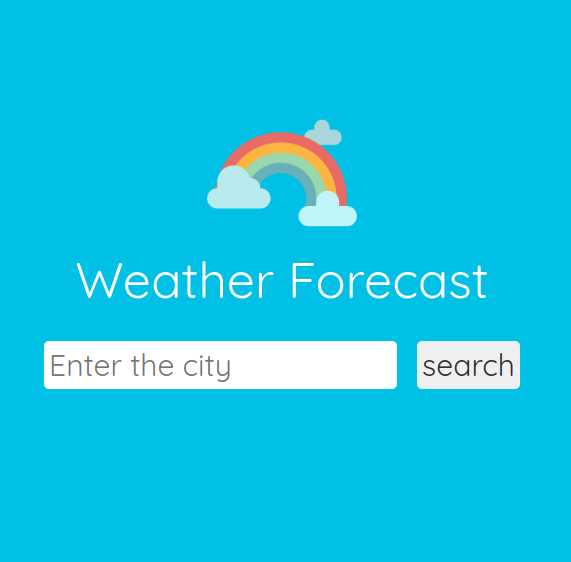
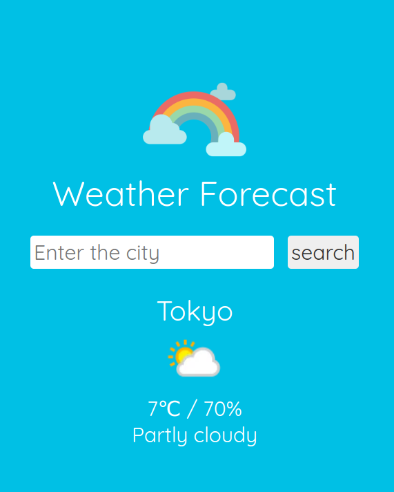

# 🌈 Weather Forecast 
## Mini Application for API Fetch / DOM Practice

### Tools I used
  
  
 

### Weather API  
This weather application utilizes the Weather API, which offers JSON and XML Weather API and Geolocation Developer API.   The API documentation can be found on [weatherapi.com](https://www.weatherapi.com/), providing detailed information on available endpoints, parameters, and data formats.

1. The start screen features an input field allowing users to enter a city name or location.  
This serves as the initial step for users to input their desired location and retrieve specific weather information.  

2. The example screen showcases comprehensive and detailed weather information.  
It might include forecast with icon, temperature, humidity to provide users with a thorough understanding of weather conditions.  

Discover the current weather conditions in your city and stay informed wherever you are!  
➡ [Weather Forecast App](https://yukosuga.github.io/weather-forecast/) 🌈